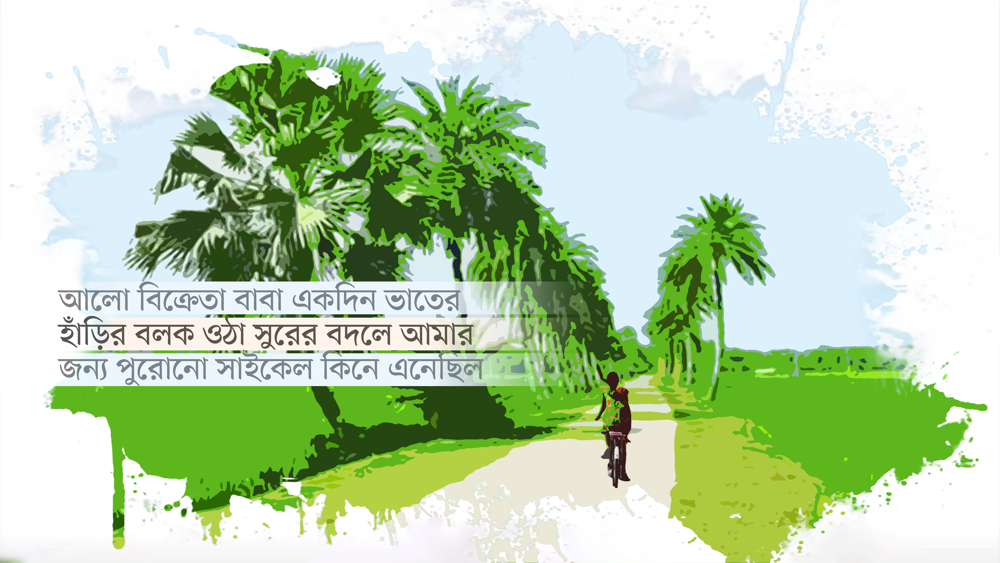

 

<h2 align=center>এই লেখা আপনাকে আর্দ্র করবে, কাব্যিক এক মন কেমন করা লেখা...</h4><h3 align=center>সুজন সুপান্থ</h3>

২.ফিরতি পথে হাঁটতে হাঁটতে কোলের কাছে টেনে আমার কাঁধে হাত রেখেছিল মা। মায়ের কাছে জানতে চেয়েছি, আখার আগুনের মতো কেন এত আলোর আকাল? ওপরের দিকে তাকিয়ে বলেছে—আকাশ থেকে ক্রমান্বয়ে খসে পড়া তিনটি তারা থেকে আমাদের জন্ম। সেই থেকে আমাদের বুকের ভেতর লুকিয়ে আছে অনেক আলো। এ কারণে আর আলাদা করে আলোর দরকার নেই। তাই যা দেখছি, সেটা ঠিক আলোর অনটন নয়। এ কথা শুনেছি কেবল, বিশ্বাসও হয়েছে। কারণ, এর কিছুদিন পর গোল হয়ে পড়তে বসা তিনজনের মাঝ থেকে একজন হঠাৎ পুরোনো প্রতিবেশী তারার দলে ভিড়ে গেছে। পড়তে বসলে সে কেবল আকাশ থেকে আরেকটু আলো ছড়িয়ে দিয়ে তাকিয়ে থাকে। এরপরও হিসাব মেলাতে পারিনি। মেলাতে পারিনি, এতকিছু থাকতে বাবা কেন সংসারের ওই অনটনের আলো বিক্রেতা হলো। মা বলেছে—পাখি ও ফুল থেকে মানুষ বেশ আলাদা। নানা সুরের ভেতর দিয়ে মানুষের জীবনকে বহুপথ টেনে নিতে হয়। বাবা তাই আলো বেচে কিনে আনে আখার ওপর ভাতের হাঁড়ির বলক ওঠা সুর। সেই সুরে এগিয়ে চলছে আমাদের জীবন। এ কারণে বাবাকে আলো আঁকতে বললে, প্রতিবার কলম ঘষে ঘষে অন্ধকারের পাশে নাম না–জানা ফুলের ছবি এঁকে প্রসঙ্গ বদলে দিত।

তাহলে পিউমনের হারিকেন এত উজ্জ্বল আলো কেন দেয়? পৃথিবীতে সে এসেছে কীভাবে? মা বলেছে—এটা সুখী মাসি বা পরান মেসো জানে। ইচ্ছা হলে যেন জেনে নিই তাদের কাছে।

দুপুরি রোদের আলোয় ঘুঁটে শুকাতে আসা সুখী মাসির কাছে এ নিয়ে জানতে চেয়েছিলাম। একগাল সরল হাসি দিয়ে আঁচলে মুখ ঢেকেছিল। শেষে বলেছে—সিঁথির সিঁদুরের লাল রং নিয়ে একটি উজ্জ্বল রক্তজবার কুঁড়ি তার পেটে আটকে ছিল। সেই কুঁড়ি নাভি বেয়ে বেয়ে ফুল হয়ে ফুটে পৃথিবীতে পিউমন হয়েছে। এ কারণে পিউয়ের হারিকেন এত উজ্জ্বল আলো দেয়। সেই আলোতে আরও ঝলমলে হয়ে ওঠে মুখ। সন্ধ্যায় যখন সে পড়তে যায়, তখন ঘরের সমূহ আলো সঙ্গে নিয়ে যায়। এ কথা শুনে আলো এড়িয়ে কেবল জবাকুঁড়ির কথা মনে হতে থাকে। ভাবি, পাখি হতে চাওয়া পিউ আসলে জবাকুঁড়ি থেকে ফুটে ওঠা ফুল!

৩.

এরপর থেকে সাঁঝ সুহানায় পিউয়ের অপেক্ষায় থাকি, অকারণে হেসে ওঠা ঝুপসি অন্ধকার ছুঁয়ে থাকি। পিউ এলে ফুটে উঠবে আলো। ধীর, শান্ত পায়ে সেই আলোর দিকে এগোই। আলো-আঁধার মুখোমুখি। পিউ তার হারিকেনের আলো ভাগ করে ফেলে। আমার দিকে ঠেলে দেওয়া আলোয় বইয়ের পাতা আরও স্পষ্ট দেখা যায়। পড়া শেষে আবার ঝলমলে আলো সুখী মাসির ঘরে পৌঁছে দিয়ে অন্ধকারে ফিরি। এভাবে আমরা হয়ে উঠি তুমুল কিশোর।

সন্ধ্যার অন্ধকার ছাড়া পিউয়ের তেমন একটা দেখা মেলে না। সে ঠিক সহচরী নয়, শুধু সন্ধ্যার সঙ্গী। তাই সঙ্গীহীন অনেকটা ছিটকে পড়ি। ছিটকে পড়ি মাঠ থেকে, আধখাওয়া পেটে পাখি ও প্রজাপতি ওড়ানো ভাইয়ের আনন্দ থেকে, কচি সুপারি কুড়িয়ে বারো দান খেলার ছক থেকে। ফুল আর পাখির কথা ভেবে একা হয়ে পড়ি। একা একা পথ চলে যায় নির্জনতার দিকে। সেই নির্জনতায় বুঝি, বুকের নিকষ অন্ধকারে আটকে আছে অচিন প্রজাপতি। কারও নাম ধরে থেকে থেকে ব্যথা দেয় তার উড়তে চাওয়া ডানার ছটফট।

৪.

আলো বিক্রেতা বাবা একদিন ভাতের হাঁড়ির বলক ওঠা সুরের বদলে আমার জন্য পুরোনো সাইকেল কিনে এনেছিল। আমার চেয়েও বেশি বয়সী গোলাপি রঙের সাইকেলে সামনে বসার জায়গা ছিল না। পেছনে ক্যারিয়ার ছিল। বাবাকে বলেছি, মেয়েদের সাইকেল না কিনে আলোটা সংসারে ফিরিয়ে আনলেই তো চুলার পাশে বসে মা তোমার মুখটা আরেকটু বেশি সময় দেখতে পারত। সেলাই ভুলে যাওয়া মা ছিঁড়ে যেতে চাওয়া সংসারে রঙিন সুতা বুনতে পারত। অন্যদিকে মুখ ঘুরিয়ে বাবা শুধু বলেছে, সাইকেলের কোনো ছেলে-মেয়ে হয় না।

প্রতিদিন সকালে বাবা আর ভাই আমাকে ভেবে সাইকেলের যত্ন নেয়। লজ্জা বেশি, ভালোবাসায় সংকোচ, আদরেও টান ধরে খুব। তাই হয়তো তাদের মনে হয়, সাইকেল ছুঁয়ে দিলে আমাকেই দেওয়া হবে স্নেহের আদর। সাইকেলটা যতটা না চালাতে হয়, তার চেয়ে বেশি হেঁটে হেঁটে ঠেলে নিয়ে যেতে হয়। শুধু শুধু চেন পড়ে যাওয়া সাইকেলটা নিয়ে আমি তাই বেল বাজাই আর ঠেলে ঠেলে চালাই। ইচ্ছা হয়, পিউকে পেছনে বসিয়ে অনেক দূরে নিয়ে যাব, যেদিকে কেবল ফুটে আছে ফুল। এরই মাঝে একদিন খবর আসে, পাখিধরা পরান মেসো নেই। বুকের ভেতরে আটকে পড়া সমূহ পাখির মৃত্যুব্যথা নিয়ে চিকলি বিলে শুয়ে পড়েছে মেসো, উঠতে পারেনি আর। বাবার শোকে পিউমন কাঁদছে, কাঁদছে কোনো দিন আলো দেখতে না পারা অন্ধ ঠাকুমা, কাঁদছে সরল হেসে ওঠা সুখী মাসি। তুমুল বৃষ্টির মাঝে মুক্তির আনন্দে চিৎকার করছে চেনা-অচেনা পাখি।সম্মিলিত হরি ধ্বনির ভেতর শববাহী মানুষের সঙ্গে আলাদা সাজে শ্মশানের দিকে যাচ্ছে পরান মেসো। ওপরে পাখি ডাকছে। খই আর সাদা কয়েনের পথ মাড়িয়ে যাচ্ছে পিউ। তার চোখ দিয়ে গড়িয়ে যাচ্ছে জল। পেছনে সাইকেল ঠেলে ঠেলে যাচ্ছি আমিও। শ্মশানের গেটে বাঁশের আড়ায় বিশাল শিমুলগাছের পাশে এবার দাঁড়িয়ে আছি পিউ আর আমি। ঘণ্টি বাজা মাত্র জ্বলে উঠল চিতার আগুন। হাউমাউ করে কাঁদছে পিউ। এক হাতে সাইকেল, আরেক হাতে পিউকে শক্ত করে ধরে আছি। পরান মেসো জ্বলছে। দূরে দাঁড়িয়ে দেখছি, পঞ্চভূতে লীন হয়ে, ধীরে, শব্দ করে পৃথিবী অতিক্রম করে যাচ্ছে পরান মেসো। চিতার দিকে তাকিয়ে মনে মনে প্রার্থনা করি—হে আগুন, জ্বলো, আরও উঁচু হয়ে জ্বলো। দাউ দাউ পুড়ে মিশে যাক পরান মেসোর দেহ। শান্ত হোক পিউয়ের গুমরে ওঠা বুক। জ্বলা শেষে আগুন নিভে গেলে একে একে সবাই চলে যায়। কান্না থেমেছে পিউয়ের। দেখি, চোখের জল মোছার পর তার মুখে লেগে আছে মেন্দি ফুলের আলো। শোকে মূক ও বধির হয়ে থাকা পিউকে পেছনের ক্যারিয়ারে বসিয়ে সাইকেল ঠেলে হেঁটে হেঁটে বাড়ি ফিরে এসেছি সেদিন বিকেলে।

৫.এরপর থেকে পিউয়ের হারিকেন নিবু নিবু হয়ে জ্বলেছে সুখী মাসির ঘরে। সুখী মাসির অসুখী ঘরে নিজেই আলোর ফুল হয়ে সন্ধ্যার পর বসে থাকে পিউ। আমাদের সন্ধ্যার দেখাও ডুবে যেতে থাকে। কোনোদিকে একা একা ফুটে থাকা বিষণ্ন ফুলের দুঃখে তাকে খুঁজতে থাকি। একদিন শেষ বিকেলে সাইকেল নিয়ে হাসিকলমি ও রূপশালি ধানের খেত পেরিয়ে শ্মশানের দিকে গেলে পিউয়ের সঙ্গে দেখা হয়ে যায়। আকাশের দিকে তাকিয়ে চিৎকার করে বলছে—কথা বলো পাখি, কথা বলো।

সেই প্রথম জেনেছি, ডানার বাসনায় পিউ পাখির সঙ্গে কথা বলে। শিমুলের ডালে বিকেল–ফেরত পাখির সুর তাকে খুব টানে। পাখির সুর নকল করা তার নেশা। যেন সে নিজেই পাখিকে গান শেখাচ্ছে। সেই সুরের আলোয় ভেসে যাচ্ছে শ্মশানের ভেতর-বাহির। সব পাখির সুর তার জানা। কোনটা ধলাকোমর শ্যামা, কোনটা চাঁদপিঠ সুইবাতাসি, কোনোটা মেঘহও মাছরাঙা, সোনাবউ, বৃষ্টিবটেরা, তিলাঘুঘু, হাঁড়িচাঁচা—সব পাখির নাম তার জানা। সব পাখি যেন তার স্বজন। সেই সব পাখির সুর নকল করে ডাকলে, ফিরতি ডাকে পিউকে সাড়া দেয় সেই সব পাখি। সে জানে কেন ময়ূরের মতো পাখা মেলে বসে থাকে বক, কোনো পাখির গর্ভে বসন্ত এঁকে আদার খুঁজতে গেছে সঙ্গী পুরুষ পাখি আর কোনো পাখির ঘরে এখন ভীষণ শীতকাল।

শেষমেশ পিউ জানিয়েছে তার ডানার বাসনার কথা। তাকে আমি জবাকুঁড়ির কথা বলি। না মেনে বলেছে, তার নাম রেখেছে পরান মেসো। পিউ আসলে একটি পাখি, পিউকাঁহা পাখি। কোকিলের মতো দেখতে ‘চোখ গেল’ পাখির আরেক নাম পিউকাঁহা। পিউয়ের জন্মের আগের দিন পরান মেসোর ফাঁদে আটকা পড়েছিল ‘চোখ গেল’ পাখি। সেই থেকে মেয়ের নাম হয়েছে পিউমন। পাখিধরা পরান মেসো পিউকে আসলে ফুলের কুঁড়ির বদলে পাখি ভাবতে পছন্দ করত খুব। বাবার পাখিধরা পছন্দ না করলেও নিজের সমুদয় ভাবনার ভেতর পাখির ছানা ছেড়ে দিয়েছিল পিউ। সেই ছানা এখন তুমুল কিশোরী পেরোতে চেয়ে উঁকি দিচ্ছে দূরে।

পাখিদের সন্ধ্যার উলু শুনিয়ে সাইকেলে ফেরার পথ ধরি। মাঝপথে পড়ে যাওয়া চেন টানতে টানতে হাতে কালি লেগে যায়। কালিঝুলি মাখা হাত হুট করে ধরে পিউ বলেছে—হাত ধরে হাঁটো। দেখবে অন্ধকারের ভেতর দিয়ে ঠিক ঠিক পৌঁছে যাবে ঘর। তারপর আমাদের দুই হাতে কালি লেগে থাকে।

ঘরে পৌঁছানোর আগে আলোর কাছে যাওয়ার মতো সন্ধ্যা নিয়ে কালিমাখা হাত ছুঁয়ে বলেছি—যদি পারো, আমার অন্ধকারটুকু মুছে দিও পিউ। ঠিক যেভাবে ভাগ করে ফেল সন্ধ্যার আলো। যদি চাও, আমি দেব ফুলের দরদ। সব যৌথ আলো ও আঁধার নিয়ে চলো, সেখানে, সেই নিঝুমের দিকে—যেখানে পাখির সুরের কাছে ফুল হয়ে ফুটে ঝরে পড়ে ফুল, আর সব ফুলের পাশে। তারপর ফুল ও পাখির সব সুষমা কুড়িয়ে সেখানে যাব তুমি আর আমি, যেখানে সুর হারানো পাখি ভুলে গেছে তার ফেরার সরণি। লজ্জাবতীর মতো কুঁকড়ে গিয়েছিল শুরুতে। হাতে হাত রেখে মুখের উজ্জ্বল আলো এই মুখের দিকে উসকে দিয়ে বলেছে—তোমার সবটুকু আঁধার এই আলোর মাঝে লুকিয়ে নিলাম আজ। সেই থেকে নিভে গেছে ব্যক্তিগত আলোর আকাল, জোনাকির সাজ।

পিউ জানিয়েছে আরও, আলো জ্বলে ওঠা বুঝতে হলে অন্ধকার থাকা চাই। আর আলো নিভে গেলে সেই অন্ধকারই অবশিষ্ট থাকে। তারপরও যদি গোপনে জ্বলে ওঠে আলো, সেই আলোজ্বলা পথ চলে যেতে পারে উচ্ছন্নের দিকে, সর্বনাশের দিকে। তবু আমি উচ্ছন্নে যাওয়ার পথ চিনে নিতে রপ্ত করি সন্ধ্যার আলো।

৬.আমাদের ক্রমাগত দেখা হতে থাকে। দেখা হওয়ার মতো অনেকের অনেক জায়গা থাকলেও আমাদের আছে শুধু শ্মশান আর চিকলি বিল। ঠিক যেখান থেকে পরান মেসোর পৃথিবী অতিক্রমের সুর বেজে উঠেছিল। পিউ আর আমি তাই শ্মশানবন্ধু। এই শ্মশানেই কেবল নিজেদের গোপন করে রাখা যায় আর সব মানুষের থেকে। পরিচিত অসংখ্য মুখ এখানে শেষবারের মতো শুয়েছিল বলে, শ্মশানকে আত্মীয়বাড়ি মনে হয়। যেন প্রতিটি পুরোনো চিতা স্বজনের ঘর। শ্মশানের প্রতিটি গাছ, গাছে থাকা পাখি, দেহ পুড়ে যাওয়া দৃশ্যের মধে৵ ফুটে থাকা ফুল, আধপোড়া কাঠ সব এখন আমাদের চেনা। চেনা হয়ে গেছে শ্মশানে পঞ্চভূতে লীন হয়ে যাওয়া আত্মার ফিসফিস, আগুন বিষয়ে তাদের সব ধারণা।

এসব ধারণা নিয়ে পরান মেসোর ছাই হয়ে যাওয়া পুরোনো চিতার ওপর শুয়ে কান পেতে আছে পিউ। যেন সে শুনতে চায়—তার আত্মা ফিরে আসতে চায় কি না। কিংবা মেসোর বুকের ভেতর থাকা মৃত পাখিদের আত্মার বিলাপ। শেষে কেঁদে ফেলে পিউ। তার কান্না থামাতে ভাঁটফুলের গন্ধ পেড়ে দিই। মধু চুষে কানে গুঁজে দিই কলকে ফুলের আলো। পিউ শ্রাবণের বর্ষার মতো হেসে উঠেছিল।

৭.একদিন বিকেলে দেখি, শ্মশানে থাকা সব পাখির সুর নকল করে পাগলের মতো ডাকছে পিউ। সুর শুনে পাখিগুলো ছুটে এসে চিৎকার জুড়ে দিয়েছে। কান্নার শব্দ নেই, তবু চোখ দিয়ে জল গড়িয়ে পড়ছে পিউমনের। কোঁচড়ে রাখা আদার আনমনে ছিটিয়ে দিচ্ছে পাখিগুলোকে। আদার দেওয়া শেষে চুপচাপ শুয়ে পড়েছিল পুরোনো চিতার ওপর। কী হয়েছে জানতে চেয়েছিলাম। কিছু না বলে, সাইকেলে চেপে দ্রুতগতিতে আরও দূরে কোথাও যেতে চেয়েছে। পেছনে বসিয়ে চেন না পড়া পর্যন্ত পাগলের মতো সাইকেল চালিয়ে বহুদূরে, সূর্যমুখীর বাগানে নিয়ে গেছি তাকে। পেছনে চুপচাপ আমার নাভি চেপে বসে ছিল পিউ। ফেরার পথেও জিজ্ঞেস করেছি। সে কেবল বলেছে—পাখিরা জানে। আমি তাকে বলেছি—আমাকে শেখাও তবে পাখিদের সুর। বলেছে—যদি পারো, আমাকে বাজাও। আমাকে বাজালেই শেখা হবে পাখির সুর। ছড় ঠেলে বাজাও আমাকে। ভেসে যাক যৌথ দুঃখ-ব্যথা। সেদিন আমি, তাকে বাজাতে পারিনি। কেবল মনে মনে বাজানোর কৌশল খুঁজে ঘরে ফিরেছি।

পরদিনও বিষণ্ন পিউ। বলেছি, যদি কারণ না বলো, তবে শেখাও তোমাকে বাজানোর কৌশল।—একদিন নিজে নিজে ঠিক জেনে যাব বাজানোর কৌশল। বেজে ওঠার অপেক্ষায় থাকবে পিউ—এই বলে জানিয়েছে, খুড়তুতো দাদা সুন্দরলাল অসভ্যতা করেছে খুব। ভয় দেখিয়ে জোর করে কয়েকবার তার প্যান্টের ভেতর ঢুকিয়ে নিয়েছে পিউয়ের হাত। বুকে ফুটে ওঠা তার সরল শস্যের দানা খুঁটে দিয়েছে। তাই বুকে তার প্রজাপতি ব্যথা। ব্যথা আর ঘিনঘিনে ভেজা হাত নিয়ে কেঁদে ফেলেছিল পিউ। এই কান্নায় গুমরে ওঠা বুকের ভেতর ফনফনিয়ে আরও বেড়ে উঠেছে ব্যথা। যেন এই পৃথিবী, তার কাছে বিপুল বিচ্ছিরি।

এসব শুনে কোথাকার এক পুরোনো হাওয়া এসে কাঁপিয়ে দিয়ে যায় এই বুকের ভেতর। পিউয়ের ব্যথার মতো ব্যথা নিতে চাই শরীরে আমার। তাই শস্য নেই, তবু নিজের বুক খুঁটে দিই। পিউয়ের সামনে নিজেই নিজের হাত ঢুকিয়ে নিই প্যান্টের ভেতর। দেখি ব্যথা নয়, অবাকের মতো ভেতরে জেগে ওঠে কিছু; আদরের মতো আরাম আসে। বুকের ভেতর ঢুকে পড়ে জিপসি নদীর ঢেউ। যেন অনেক দূরে বেজে ওঠা একটা অচেনা সুর ক্রমশ কাছে এসে সারা গায়ে হাত বুলিয়ে দিচ্ছে, ভুলিয়ে দিচ্ছে বাড়ি ফেরার পথ ও খিদে। প্রথমবার শোনা সেই সুর কেন যেন ভালো লেগে যায়। এই কথা শুনে চোখের জল শুকিয়ে যাওয়া গাল নিয়ে খিলখিল হেসে ওঠে পিউ।

হাসি শেষে শান্ত ভঙ্গিতে বলেছে, এই সুরের কথা কাউকে বোলো না। ভেতর জেগে যদি আদরের মতো আরাম আসে, তবে বাড়ি ফেরার পথ ও খিদে ভুলে যাওয়ার কথাও বোলো না। বরং একা হও, আরও একা হও। নিজেকে আরও গভীর গোপন করে রেখো পৃথিবী থেকে। যতটা নির্জন হলে গায়ে বসে বাহারি প্রজাপতি ডানা মেলে নাচে।

অবিরাম যদি বাজতে থাকে সুর, তবে অপরাজিতা ফুলের দিকে তাকাও। জবাকুঁড়ি ফুটে ওঠার তালে নিজেকে বাজাও, আর মধু চুষে নিয়ে কলকে ফুল রেখে দাও নাভিতে তোমার। দেখবে, অকাল বর্ষায় কেমন ভিজে যাচ্ছে তোমার শরীর, ফুলের মতো ফুটে ওঠা সুখ। এমন ভিজে যাওয়া ব্যক্তিগত সুখ জমিয়ে জমিয়ে তৈরি করতে পারো মায়াবী সুরের বুনো বেহালা। যার সামনে এই বেহালা বাজানো হয়, সে ছাড়া আর কেউ এই মায়ার সুর শুনতে পারে না। এই বেহালা বাজাতে পারলেই শিখে যাবে পাখিদের ভাষা। শোনো, আরও শিখে যাবে আর ছড় টেনে আমাকে বাজানো। আর বাজাতে বাজাতে ঝরিয়ে দিতে পারো ভেতরের সব আকাশ আমার।

তাহলে সুন্দরদার সুখে তোমার ব্যথা কেন হলো? বলেছে—প্রেমহীন অনিচ্ছার আদরে ব্যথা আসে। আর ব্যথা এলে কখনো সুর বেজে ওঠে না। মনে রেখো, সুর না বাজলেই পাপ, অনিচ্ছার রমণ যেমন। অনিচ্ছার রমণে ঘ্রাণহীন লহু বর্ণের ফুল আর বোবা পাখির জন্ম হয়। আকাশের তারা বা জবাকুঁড়ি থেকে নয়, মানুষের জন্ম হয় বুনো বেহালার সুরে মুগ্ধ রমণে—এই কথা সেদিন প্রথম জেনেছি পিউয়ের কাছে। মা ও সুখিমাসি তাহলে এত দিন ভুল জেনেছিল! পিউ এসব জেনেছে তার কিশোরী পেরোতে চাওয়া শরীরে কুসুম ফুটেছিল বলে।

৮.

সুন্দরদার ভয়ে ইদানীং লুকিয়ে থাকে কুসুম ফোটা পিউ। বলেছি একদিন—লুকিয়ে থাকার বদলে চলো তবে ফুল হই। ঘন হই, নিবিড় করি প্রেম। প্রজাপতির কাছে প্রার্থনা করি, ফুলের গর্ভে যেন ফুটে থাকি খুব। ফুল হয়ে দুলে দুলে ছড়িয়ে দেব বুনো বেহালার সুর ও মায়া। গাছে গাছে আমাদের অজস্র সন্তান হোক। তারপর ধীরে, গুছিয়ে নেব সব। যেভাবে আগলে রেখেছি পরান মেসোর শোক।

সে জানিয়েছে, আহা, ফুলের কেবল ঝরে পড়ার তাড়া। এর চেয়ে বরং পাখির আদরের কথা ভাবো। আদর শেষে খসে পড়া পাখির পালক কুড়িয়ে একদিন ঘর বানাব। সেই ঘরে আমরা একে অপরের উপশমহীন ভীষণ অসুখ হব। চলো বুকের ভেতর দুজন এঁকে রাখি দুজনের মুখ, যেভাবে ঠাকুমা এঁকে রেখেছে তার অন্ধ পৃথিবীর পুরোনো প্রেমিকের ছবি, যেভাবে অন্ধ ঘুঘু এঁকে রেখেছে পুরোটা পথ। না দেখা পথ পেরিয়ে যেভাবে সে ঠিক পৌঁছে যায় সঙ্গীর ঘরে—এমনভাবে আঁকো। তারপর পথ হারানো পাখির ডানার অন্ধকারে ঢুকে কাটিয়ে দেব পুরোটা অসুখকাল।বুনো বেহালার সুর বুঝে নেওয়ার আগেই শ্মশানের ভেতর সন্ধ্যা নেমে আসে। ওপরে ঘরে ফেরা পাখিদের ধুন ছেড়ে এসে দেখি, আমার সাইকেল চুরি গেছে শ্মশানের গেটে। সাইকেল হারানোর ভয় ও শোকে উথালপাতাল বুক। বুঝতে পারে পিউ। তারও খুব মন খারাপ হয়। আমার কান্না আসে, যতটা না বাবার জমানো আলো বেচা টাকা দিয়ে কেনা সাইকেল হারানোর ব্যথায়, তার চেয়েও বেশি আসে, বাবা ও ভাইয়ের স্নেহ হারালাম বলে। সামনের অন্ধকার পথ আজ ঝাপসা হয়ে আসে। চোখ মুছে দিয়ে আমার হাত টেনে বুকের কাছে চেপে রাখে পিউ। ঝাপসা অন্ধকারের ভেতর দিয়ে পৌঁছে যাই ঘরে। দূর থেকে ফিরে এসে আবার আমার ডাকনামে ডাক দিয়ে ফিরে ফিরে দেখে ঘরে ফিরে গেছে পিউ।

৯.সাইকেলহীন পথ এখন বহু দূর মনে হয়। দেখা হওয়ার নিয়ম ভেঙে যায় আমাদের। সুখিমাসি মাশান ঠাকুরের ভয় দেখিয়েছে, তাই শরীরে লাল কুসুম ফোটার কালে পিউ শ্মশানের দিকে যেতে চায় না। আমি কুসুম ঝরে পড়ার অপেক্ষায় থাকি। দেখা না হোক, তবু তার কুসুম ঝরে গেলে দেখা হওয়ার সম্ভাবনাটা অন্তত থাকে। এমনই একদিন সাইকেল হারানোর দুঃখ নিয়ে ধানখেতের আল ধরে শ্মশানে পৌঁছে যাই। দেখি, চারধারে ফুটে আছে সময়-অসময়ের ফুল। বসন্তে ফোটা শিমুল ফুল এখন শক্ত তুলোফল। সেই ফল ফেটে চারদিকে ছড়িয়ে পড়ছে সাদা সাদা তুলো। পিউ তুলো কুড়িয়ে ছড়িয়ে রাখছে পাশাপাশি থাকা দুটি পুরোনো চিতার ওপর। মাঝে সাজিয়ে রেখেছে বহু বর্ণের ফুল।

কচি কলাপাতা গোল করে হাতে ধরিয়ে দিয়ে তুলোয় সাজানো চিতার ওপর শুয়ে বলেছে—নাও, ওই চিতার ওপর চিৎ হয়ে শুয়ে পড়ো। শুয়ে শুয়ে এই বনদুরবিন দিয়ে পৃথিবী দেখো। দেখবে, চেনা পৃথিবী কেমন আলাদা হয়ে ধরা দেয়। আমরা দুজন দুটি বনদুরবিন দিয়ে দেখি পৃথিবীর রূপ।বনদুরবিনে যতক্ষণ চোখ রাখি, ততক্ষণ পৃথিবী আলাদা মনে হয়। চুপচাপ দেখি, পুরোনো পৃথিবীর মায়ের মতো চাঁদ, দেখি মেঘ, আকাশ, ফুল, অকালকুসুম; আর দেখি সবুজ দৃশ্য, পাখিদের প্রেম ও আদরমালা। ওই দূরে, বিলের ধারে জলধনিয়ার ঝোপের কাছে একটি সাদা হাঁসের পিঠের ওপর বসে তুমুল আদর করছে একটি কালো হাঁস। দূরে দাঁড়ানো জলময়ূরকে একান্তে পাওয়ার বাসনায় ভেসে থাকা পদ্মপাতার ওপর ঝগড়ায় মেতেছে দুই জলময়ূরী। দাঁতে কামড় দিয়ে নিজের ছানাকে নির্জনতার দিকে নিয়ে যাচ্ছে সদ্য মা হওয়া একটি কুকুর। দাঁতের কামড়ে কুকুর ছানার ব্যথা করছে না? পিউ বলেছে, এটাও আদর। ওই দাঁতে ব্যথা নেই। আরাম আছে, আছে নির্ভরতা। ব্যথা কেবল মানুষের দাঁত আর আদরে থাকে। আদর পর্যন্ত পৌঁছে গেলে তুমিও জেনে যাবে সব।কথা রেখে আবার দেখি, সদ্য ঘর থেকে বেরিয়ে আকাশ দেখা ছোট্ট পাখির চোখে পথ এঁকে তাকে ওড়ার স্বরবর্ণ শেখাচ্ছে মা পাখি। আরেক ডালে বসে আর সব পাখি থেকে একা হয়ে একটি পুরুষ পাখি শিস দিয়ে ডেকে নিচ্ছে সঙ্গী পাখিকে। ঠোঁটে ঠোঁট রেখে তারা সৃষ্টি করছে মায়াবী সুর। সেই সুরে টুপ করে একটি পালক খসে পড়ল। পালক খসার পথ ধরে বনদুরবিনে দেখি পিউয়ের বিষণ্ন মুখ। দেখি তার চোখের টলটল, আরেকটি পৃথিবী। সেই পৃথিবীর ভেতর আমারই যাওয়া-আসা।

১০.

পৃথিবী দেখা শেষে বুকের ভেতর না–বলা কথা নিয়ে দুজন পাশাপাশি চিতার ওপর চুপচাপ শুয়ে আছি। ওপর থেকে টুপটাপ ঝরছে কদম ফুলের রেণু। কদম ফুলের মাতাল ঘ্রাণ আর চিতার আংরার পুরোনো পোড়া গন্ধ মিশে ভেসে যাচ্ছে শ্মশানবাড়ি। ঝরে পড়ছে ছাইচাপা আগুনের মতো পাতা। বৃষ্টি সম্ভাবনায় কালো হয়ে যাওয়া মেঘ হাওয়া দিচ্ছে। ব্যাঙের ছাতা ভাঙা হাওয়ায় এ ওর দিকে হাত বাড়াই। দুজন দুজনের গায়ে লেগে থাকা ফুলের ঘ্রাণ শুঁকে নিই। আকুল হয়ে ছুঁয়ে দিই, ঠোঁট রাখি হাতে।কালো মেঘ ভেঙে এল বৃষ্টির ঝুম। দৌড়ে কচুপাতার মুকুট পরে জল থেকে বাঁচিয়ে রাখছি মাথা। বৃষ্টিতে ভিজছে কলকাসুন্দা ফুল, ময়ূরশিখা, হাতিশুঁড়, চন্দ্রপ্রভা, বেগমবাহার, দলকলস, লতাকস্তুরি, মুক্তাঝুরি। চিতার ওপর শুয়ে ভিজছে পিউ। ভিজছে মিথুন শেষের হাঁস ও আদর খাওয়া পাখি।

১১.বৃষ্টি শেষের রোদে ঘরে ফিরে পরদিন জ্বর, অসুখ আমার। অসুখ হয়ে ছুটে যাই শ্মশানবাড়ি, পিউয়ের কাছাকাছি। কপালে হাত দিয়ে পিউ হেসে বলেছে, ভিজলাম আমি আর অসুখ হলো তোমার! তাহলে দেখো, কী গভীর সম্পর্কের ভেতর দিয়ে আমরা পেরিয়ে যাচ্ছি পৃথিবী পথ। তুমি আজ অসুখ হয়ে এলে! চলো চিতা থেকে আরও দূরে, গভীর গোপনে তবে একা হয়ে যাই। যদি ক্ষীণ হয় আলো-মেঘ করে খুব, তবে মাটিতে পায়ের আঙুল ঘষে ঘষে সরিয়ে দেব আকাশের কালো। মায়াবী সুর তোলো, ছড় টানো, বাজাও তোমার বুনো বেহালার সুর। ডানা মেলে দিক নাচ ভুলে যাওয়া সব প্রজাপতি, তোমার সঙ্গে ঝুমতালে ঝরুক ব্যক্তিগত আকাশ আমার। যদি চাও, যৌথ আনন্দ নিয়ে নির্জনে, ধীর লয়ে আমাকে বাজাও।এই আহ্বানে ঘন হয়ে উঠি। নিবিড় হই। বুকের ধুকপুকে ঢুকে ডানা মেলে নাচে ময়ূর চোখের প্রজাপতি, ঢোকে অচিন নদীর ঢেউ। আদর জাগে, জাগে আরও কেউ। ছুঁয়ে দিই। জবাকুসুমের দুলে ওঠার তালে নিজেকে বাজাই। দেখি, একটা শান্ত সুরের ভেতর দিয়ে শিউলি ফুল ফুটে উঠছে সারা গায়ে। পিউ সঙ্গে করে এনেছে নীল অপরাজিতা। তাকে দেখি, দেখি অপরাজিতার রূপ। সবটুকু দরদ চুষে নিয়ে কানে গুঁজে রাখা কলকে ফুল খুলে সে ঢেকে দিয়েছে আমার নাভি। যেন চারদিকে বেজে উঠছে বসন্ত মুখারি। আকাশের মেঘ সরে গেছে দূরে, তবু সেই সুরে বিপুল বর্ষায় ভিজে যাচ্ছে ফুলের মতো ফুটে ওঠা সুখ।নিজেকে বাজানোর পর আমার ভিজে যাওয়া সুখে কেঁপে কেঁপে উঠছে সামনে বসা পিউ। শরীর বেয়ে নেমে যাওয়া হিমসুরে ফুলে উঠছে সে, ফুলে উঠছে বুকে বেড়ে ওঠা শস্যের দানা। যেভাবে রোদ পেলে ফল ফেটে ফুলে ওঠে কার্পাস তুলো। নিজেকে বাজিয়ে ভিজলাম আমি, তবে এই হিমসুরে কাঁপছ কেন তুমি? জানিয়েছে, যে সম্পর্কে আমি বৃষ্টিতে ভিজলে জ্বরে কেঁপে ওঠে তোমার শরীর, ঠিক সেভাবেই। তুমি তো বাজিয়ে ফেলেছ বুনো বেহালার সুর। সেই আনন্দে আমাকে বাজাও, এবার ঝুমতালে আমাকে ভেজাও। এই ঠোঁটে তারার আলো এঁকে দিয়ে চুপিসারে বলেছে, গভীর করো প্রেম। সাড়া দাও, বাজাও। শরীরে বধির হয়ে বেজে উঠুক কেঁপে ওঠা হিমসুর। সেই সুর শুনে জাগিয়ে তোলো আরও আরও ভেতরের শ্রী। গায়ে ফুটুক তোমার মতো নানা বর্ণের ফুল। শোনো, এটাই ভীষণ আদরের মৌসুম। নাও, প্রাণখুলে দেখে নাও, যেখানে ফুটে থাকে আমার কুসুম।

১২.হিমসুরের ভেতর পানাফুলে জমে থাকা জল ছিটিয়ে পিউমনের বুকের কাছে গান হয়ে আছি। তার চোখের টলটল পেরিয়ে দেখি, বুকের কাছে কচি লতার মতো মায়া ফুটে আছে। অপরূপ সেই মায়া থেকে কবেকার ভুলে যাওয়া মাতৃস্তন্যের মতো কোমল হাওয়া এসে পূর্ণ করে দিচ্ছে এই বুক। সেই মায়া ছুঁয়ে আছি, ফুরিয়ে যাওয়ার ভয়ে খুব করে ঠোঁট ছুঁয়ে আছি ঠোঁটে। যেন ঠোঁট ফিরে গেলে থেমে যাবে হিমসুর। ভেজা শাড়ি রোদে দেওয়ার মতো করে নিজেকে মেলে দিয়েছে পিউ। তার গায়ে ফুটে আছে অজস্র জবাকুঁড়ি। নাভিতে গোপন হয়ে আছে চালতা ফুলের আলো। বলেছে, ঠোঁট দাও, ঠোঁট দিয়ে তোমার অন্ধকারে বিপুলভাবে তুলে নাও এই আলো। চালতা ফুলের গভীরে মুখ রাখি প্রেমে। কাম ও বিষাদ পেরিয়ে দেখি, আলো ফুটে ওঠার আগেই মেঘ ফেটে নেমে গেছে বৃষ্টির ঝুম। আর চালতা ফুলের নিচে ভিজে যাচ্ছে অপরূপ গোপন কুসুম।ভেজা শেষে বলেছে, ঘ্রাণ নিয়ে দেখো, আমরা এখন ফুল হয়ে ফুটে আছি দুজনের বুকের ভেতর। চলো তবে ঝরে পড়ার আগে আরও ঘন হয়ে উঠি। দুলে দুলে ছড়িয়ে দিই বুনো বেহালার সুর ও মায়া। স্থির করো শরীর ও মন। যদি চাও, বৃষ্টি শেষে আকাশ ফরসা হওয়ার আগেই পাখিদের মতো সেরে ফেলি ইচ্ছের রমণ। তারপর আমাদের ছায়া নিয়ে গাছে গাছে ফুটে থাকুক অজস্র ফুল। বলেছি তাকে, সবকিছু মেলে দিও না। কারও জন্য একটু গোপন রেখো সুর। সেই গোপন ভালোবাসো। এই গোপনের কথা বোলো না কাউকে। শোনো, আরও বহু আদরের ইচ্ছায় ভরে থাকুক তোমার আকাশ, কুসুম। জমিয়ে নাও আদর শেষে খসে পড়া পাখির পালক। সেই পালকে আমাদের যৌথ ঘর হোক। আলো জমিয়ে রাখছি খুব, একদিন সেই ঘরে তোমার সিঁথিতে এঁকে দেব জ্যোৎস্নার উল্কি, গোপন কুসুমে রেখে দেব বসন্তের ডাক। আশা রাখি, সেই জ্যোৎস্নার আলোয় বড় হবে গাছে ফোটা সুগন্ধি ফুল আর কথা বলা পাখি। মুখ ভার করা পিউ কিছু বলেনি। কেবল চুল সরিয়ে সিঁথিপথ আরও বাড়িয়ে দিয়ে চোখে রেখেছে তার টলটলে চোখ।বৃষ্টি শেষে ছায়া মেলতে শেখা কচি শিমুলের ডালে মনস্কামনায় চিতা থেকে তোলা ঢিল বেঁধে দিই, সেলাই ভুলে যাওয়া মানতের সুতো আর বেঁধে দিই ওড়নার লাল। ঘরে ফেরার পথে চিকলির জলে নেমে পড়ি লজ্জাহীন। মুখোমুখি হাত ধরে ডুব দিয়ে বলি—হে জল-হাওয়া-শিমুল, আরও আলো দাও। সিঁথিতে আঁকা হোক জ্যোৎস্নার উল্কি, গোপন কুসুমে রাখা হোক বসন্তের ডাক। সেই আলোয় ভরে উঠুক ঘর। ফুল-পাখিতে ভরে উঠুক আমাদের সংসার। আর আমাদের না পাওয়া, বুকে চাপা সমূহ কষ্ট কিংবা ঝরে পড়ার তাড়া যেন হতে পারে পথ হারা পাখির আদার।

১৩.আমাদের এমন আরও অসংখ্য আদরের বিকেল থেকে বুনো বেহালা ও হিমসুর পেরিয়ে গেছে প্রাচীন সন্ধ্যার দিকে। শ্মশানের ওপার থেকে সেই হিমসুর চুরি করেছিল আরও এক নির্জন প্রেমিক। চিতার আগুন জ্বলে ওঠার আগে শ্মশানে ঘণ্টি বাজানো জগাই দূর থেকে দেখেছিল চালতা ফুলের আলো, ভালোবেসেছিল। পথ হারানো পাখির ডানার অন্ধকারের ভেতর গোপন কুসুমে বসন্তের ডাক চেয়েছিল যে পিউ, তার অসহায় সিঁথিতে জোর করে আগুন এঁকে দিয়েছে ঘণ্টিবাদক।জগাইর সাজানো ঘরে আনন্দ ভৈরব হওয়ার আগে পিউ একবার এসেছিল। এলোমেলো সিঁথি গুছিয়ে দিয়ে বলেছি—অসুখ হয়ে থাকার বাসনা ভোলো। অতীতের সমস্ত সুর ও সুখ নিয়ে তুমি ফুটে থাকো ওই নির্জন প্রেমিকের বুকের ভেতর। যেটুকু সুর গোপন ছিল তোমার, নিবিড় হও, বিপুলভাবে তাকে মেলে ধরো এবার।এদিকে ঘন হয়ে উঠছে ব্যক্তিগত আকাশ। পুরোনো দিনের মতো সমস্ত আকাশ থেকে বৃষ্টি ঝরছে, ঝরে যাচ্ছে। চোখের জল ভাঙছে পিউ। তার চোখের জলে টুপ করে ঝরে পড়ছে আমার ছোট হয়ে ঢুকে থাকা ছায়া। বুকের ভেতরে জড়ো হয়ে ঢুকে ঢেউ বাড়িয়ে দিল জলের। ছায়া নিয়ে তার চোখের জল ঢুকে পড়ছে শরীরে আমার। আর আমার জল ছুঁয়ে দিচ্ছে পিউয়ের কাঁধ। শেষবারের মতো নিজেকে মেলে দিয়ে বলেছে—এই নাও, সব বিষাদ ও বিচ্ছেদ দাহ করে দাও নাভিতে আমার। প্রাণ ভরে চুষে নাও সব আলো ও ঘ্রাণ। যদি পারো বিলিয়ে দিও গাছে গাছে ফুটে থাকা ঘ্রাণহীন ফুলে ও বোবা পাখিগুলোর চোখের ভেতর। এরপর এই হাত তার নাভির গভীরে রেখে বলেছে, বিষাদ ও বিচ্ছেদ পোড়া গন্ধে লিখে রেখো প্রেম-পাখি ও প্রজাপতি, জবাকুঁড়ি, চালতা ও আর সব ফুলের কথা লেখো, হিমসুরে ভিজে যাওয়া গোপন কুসুম, লেখো পালক খসা পাখির উসুম, লেখো বহুদিন পরও হাওয়ায় দোলা মানতের সুতোয় ভরসা রাখি, লিখে রেখো চিনে রাখা পথ ভুলে উড়ে গেছে পিউকাঁহা পাখি।

