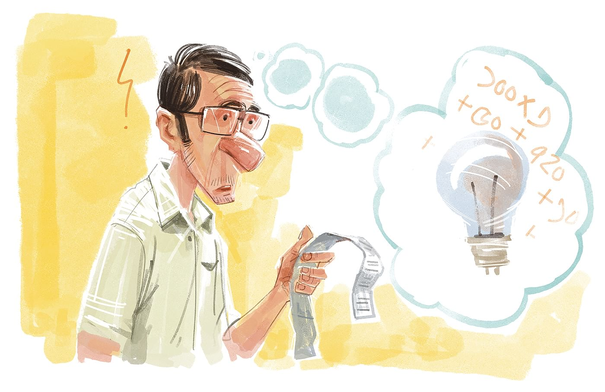

 

<h2 align=center>এক ঢিলে তিন পাখি</h4><h3 align=center>রম্য লেখক ও কার্টুনিস্ট</h3>

তবে খেয়াল করলেন, কেস জেনুইন; ওরা তিনটে বাল্বই এক এক করে জ্বালিয়ে দেখাচ্ছে। এর মধ্যে কোনো ফাঁকি নেই। দিন-দুপুরেও বেশ ফকফকা আলো। ১০০ টাকারই তো মামলা। সাইফুদ্দিন সাহেব চট করে ১০০ টাকায় তিনটে বাল্ব কিনে ফেললেন। বাসায় ফিরে স্ত্রীকে দেখালেন বছরের শুরুতেই যে তিনি দাও মেরে দিলেন—১০০ টাকায় তিনটে বাল্ব।

—দেখো সস্তার তিন অবস্থা না হয়! স্ত্রী সন্দেহ প্রকাশ করলেন।

—সে অ্যানালগ যুগে সস্তার তিন অবস্থা ছিল, এখন ডিজিটাল যুগ। এই যুগে আসলে সস্তার তিন ব্যবস্থা। একসঙ্গে তিন বাল্ব। সাইফুদ্দিন সাহেবের মুখে গর্বের হাসি। যেন তিনি এক ঢিলে দুই পাখি নয়, তিন পাখি মেরেছেন।

তবে বাল্ব লাগাতে গিয়ে টের পেলেন, তিনটেই পিন হোল্ডার বাল্ব, মানে প্যাঁচের বাল্ব নয়, যুগটা তো প্যাঁচের চলছে। আগে খেয়াল করেননি। কী আর করা, বাল্ব জ্বালানোর প্রয়োজনে তিনটে কনভার্টারও কিনে আনলেন—একেকটা ৩০ টাকা করে। তার মানে ১০০ টাকার তিন বাল্ব হলো এখন ১৯০ টাকা। তা–ও লস নেই।

প্রথমে বড় বাল্বটা লাগাতে গিয়ে একটা ছোট্ট দুর্ঘটনা ঘটল। বুম করে একটা শব্দ হলো। তারপর বাল্বটার সামনের বাটির মতো সাদা অংশটুকু দ্বিতীয় বিশ্বযুদ্ধের টমাহক মিসাইলের মতো ছুটে এসে... খাবার টেবিল গোছাচ্ছিলেন যে মধ্যবয়সী বুয়া, সটান তাঁর কপালে আঘাত হানল। ‘ও মা গো... মাআআআ... আঁরে মারি ফালাইছেএএএ...!’ একটা গগনবিদারী আর্তচিৎকারে বুয়া কাটা কলাগাছের মতো আছড়ে পড়লেন মোজাইক করা মেঝেতে। মুহূর্তে কপাল কেটে রক্তারক্তি। সেটা অবশ্য ঠিক বাল্বের টমাহক আক্রমণে নয়, মেঝেতে আছড়ে পড়ার কারণে। যা হোক, সঙ্গে সঙ্গে তাঁকে ধরাধরি করে নিয়ে যাওয়া হলো কাছাকাছি একটা ডিসপেনসারিতে। তারা বলল, কমপক্ষে দুটো সেলাই লাগবে। ডিসপেনসারির লোকেরাই সেলাই দেওয়ার ব্যবস্থা করে প্রাথমিক চিকিৎসা দিয়ে তারপর ছাড়লেন বুয়াকে। বেরিয়ে গেলে ৭২০ টাকা। ১০০ টাকা বাল্বের দাম পড়ল এখন ৯১০ টাকা। বুয়াকে ছুটি দিয়ে রিকশায় করে বাড়ি পাঠানো হলো। রিকশার ভাড়া ৫০ টাকা ছাড়া আরও ১০০ টাকা নগদ দেওয়া হলো তাঁর হাতে, এই অবস্থায় ফলমূল খাওয়া দরকার, ভিটামিন সি জরুরি। তার মানে ১০০ টাকার তিন বাল্বের দাম দাঁড়াল একুনে হাজার চল্লিশ টাকা

ওই রাতেই সাইফুদ্দিন সাহেবের বাড়ি ঘেড়াও করল বস্তির লোকজন। বস্তির এক মহিলাকে মারধর করে কপাল ফাটিয়ে দিয়েছে এই বাড়ির ভদ্রলোকেরা। তাদের মধ্যে কাজের বুয়ার স্বামীকেও দেখা গেল মাথায় গামছা বাঁধা, হাতে লাঠি! আরও অনেকের হাতেই লাঠিসোটা। কাজের লোকদের মারধরের ঘটনা আজকাল আকছার হচ্ছে। টিভি খুললেই দেখা যায়। মুহূর্তেই টহল পুলিশ এসে হাজির হলো। একটু বাদে একটা চ্যানেলের ছাপ মারা ক্যামেরাও দেখা গেল। কামেরার সামনে দাঁড়িয়ে একজন বলছেন, ‘এ্যাঁ এ্যাঁ... সমাজ আজ কোথায় গিয়ে দাঁড়িয়েছে। শিক্ষিত ভদ্রলোকেরা জানোয়ারের মুখোশ পরে আমাদের সমাজে বাস করছে নইলে... একজন নিরীহ বস্তিবাসী কর্মজীবী নারীর ওপর এ কী রকম নির্যাতন... এ্যাঁ এ্যাঁ...!’

পুলিশ, চ্যানেল, বস্তিবাসী—সবাইকে সামলে গভীর রাতে সাইফুদ্দিন সাহেব তাঁর ১০০ টাকায় কেনা তিন বাল্বের হিসাব নিয়ে বসলেন। শুরুতে সংখ্যাটা চার অঙ্কের ছিল। এখন মনে হচ্ছে সেটা পাঁচ অঙ্ক ছাড়িয়ে গেছে। দেয়াল ঘড়িতে ঢং ঢং করে বারোটা বাজল। দুই হাজার বাইশ সালের দ্বিতীয় দিনের শুরু!

সাইফুদ্দিন সাহেবের মনীষী কারলাইলের দ্বিতীয় আরেকটি বাণীর কথা মনে পড়ল, ‘তুমি যদি মনস্থ করে থাকো, তুমি কোনো বোকা লোকের চেহারা দেখবে না, তাহলে সবার আগে তোমার দাড়ি কামানোর আয়নাটি ভেঙে ফেলো।’

সাইফুদ্দিন মনে করার চেষ্টা করলেন, সকালে দাড়ি কামিয়েছেন কি না। কিন্তু তিনি সেটা কিছুতেই মনে করতে পারলেন না!

