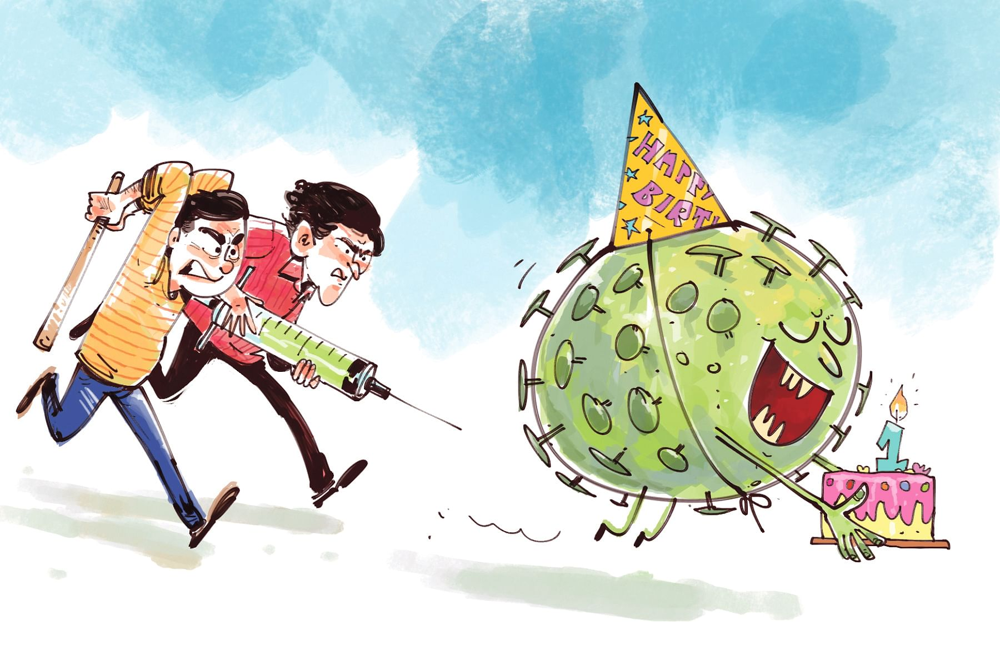

 

<h2 align=center>কোভিড-১৯ ব্যাটার এটাই যেন হয় শেষ জন্মদিন</h4><h3 align=center>আবুল মনসুর</h3>

হাঁটি হাঁটি পা পা করে বাংলাদেশে কোভিড–১৯–এর এক বছর হতে চলল। এ সময় আমার মতো অনেকেই ঘরবন্দী হয়ে লুঙ্গির ভেতর দিনের পর দিন কাটিয়েছেন। আর কী কী হয়েছে এই করোনা–বছরে? যাপিত জীবনে বড় কোন কোন ওলট–পালট ঘটেছে? এসব হিসাব করার মতো প্রতিভা বা হিম্মত কোনোটাই আমার নেই। তবু আকাশ–পাতাল ভাবি, এক বছরে অন্যে ভাবেনি, এমন কিছু আছে কী। ঘরের মধ্যে বন্দী থেকে স্বামী-স্ত্রীর সোহাগ বেড়ে যাওয়া কিংবা উল্টোটি ঘটা—এসব ‘গোপন’ কথা জানাজানি হয়েছে আগেই। রবীন্দ্রনাথ তো ঘটনা অনেক আগেই টের পেয়েছিলেন, তাই লিখে রেখে গেছেন ‘কাছে থেকে দূর রচিল’। অবশ্য জন্মহার বেড়েছে কি না, সে তথ্য পাইনি। রেস্তোরাঁ, বিনোদন পার্ক, বিয়েশাদি, জন্মদিন, পাহাড়, সমুদ্র—সব বন্ধ ছিল একটা সময়। বিনোদনের অন্য উপায় তো ছিল না। মনোবিজ্ঞানীরা এ বিষয়ে সঠিক পরিসংখ্যান দিতে পারবেন মনে হয়।

করোনাকালে কোনো কোনো স্বামী অভিযোগ করেন, ওই সময়ে অনভ্যস্ত শরীরে গৃহস্থালির কাজ করতে করতে তাদের শারীরিক অবনতির সঠিক মূল্যায়ন হয়নি। গিন্নিরা কেউ কেউ অবশ্য গৃহকর্মে স্বামীর অংশগ্রহণকে অভিনন্দিত করেছেন, একটু সক্রিয় নারীবাদীরা নারী-পুরুষের সমানাধিকারের ক্ষেত্রে একে সতর্ক ইতিবাচকতার সঙ্গে গ্রহণ করেছেন। অবশ্য এই ‘অস্বাভাবিক’ পরিস্থিতি বেশি দিন লাস্টিং করেনি, অচিরেই বাঙালি-অবাঙালিসমেত বিশ্ববাসী আগের অবস্থায় ফিরে স্বস্তির নিশ্বাস ফেলেছে। খুন-ধর্ষণ, সড়ক দুর্ঘটনা আবার আগের স্বাভাবিকতায় ফিরে এসেছে।

আর প্রাণিকুল? তাদের প্রতি ভয়-ঘৃণা ভুলে সব মানুষ তাদের মাথায় তুলে নাচবার অবস্থা। সচেতন-অসচেতন সবাই গম্ভীর মুখে রায় দিলেন, প্রকৃতির প্রতিশোধ। পত্রিকার কার্টুনিস্ট আঁকলেন, মানুষ খাঁচার ভেতর বন্দী অবস্থায়, আর দর্শনার্থী বানর-হাতি-শিয়ালদের ছুড়ে দেওয়া কলাটা-মুলোটা খাচ্ছে। বটেই, এমনটিই তো হওয়ার কথা ছিল। গভীর জঙ্গলের ভয়ংকর প্রাণীরা কানাডা, যুক্তরাষ্ট্র, ইউরোপের পথেঘাটে আরামে বিচরণ করছে, হাঁস মা ছানাপোনাদের নিয়ে মার্চ করে রাস্তা পার হচ্ছে—কী অপূর্ব, কী অপূর্ব—অভূতপূর্ব! বাংলাদেশের বেঙ্গল টাইগাররা ঢাকা পর্যন্ত বেড়াতে আসার সাহস না পেলেও বিরল পিঙ্ক ডলফিন কক্সবাজার উপকূলে ডিগবাজি খাচ্ছে—এ দৃশ্য আগে কে দেখেছে? আমাদের বাবা-দাদারাও না। কোনো কোনো ধর্মীয় এলেমদার দিলেন সাবধানবাণী, এ আল্লাহর গজব, এখনো সময় আছে, দ্বীনের পথে ফেরো। আবার বক্তৃতাপ্রবণ মান্যবর বললেন, মানুষের মানবিক সংবিৎ ফেরানোর জন্য এটি একটি ‘ওয়েক-আপ কল’। পরিবেশবিশারদ কঠোর প্রবন্ধ লিখলেন, এটি মানুষের গালে প্রকৃতির চপেটাঘাত, ফিরে যাও আড়ম্বরহীন সরল জীবনে। আবারও রবীন্দ্রনাথের শরণ নিতে হয়, ‘দাও ফিরে সে অরণ্য, লহ এ নগর’—এ রকম আরকি। তাই কোভিড-১৯–কে সবাই মিলে গালমন্দ না করে তার বর্ষপূর্তিতে প্রকৃতিপ্রেমীরা তাকে কিছু অর্গানিক পুরস্কার প্রদানের কথা ভাবতেই পারেন।

তবে সবার জ্ঞানগর্ভ বাণীটানি মিথ্যা প্রমাণ করে পৃথিবী এখন মোটামুটি স্বাভাবিক হয়ে এসেছে। কক্সবাজার ডলফিনে নয়, মানুষে মানুষে সয়লাব, টিভি চ্যানেলরা সগর্বে সে কথা প্রচার করে চলেছে। চট্টগ্রাম থেকে বিশাল আধুনিক জাহাজ হাজারে হাজারে ভ্রমণপিপাসুদের নিয়ে যাবে সেন্ট মার্টিন, ভ্রমণ ছাড়াও আরও পিপাসা তো রয়েছে—লম্ফঝম্প, কর্ণবিদারী সংগীত আর কোরালের একটি স্মারক টুকরা। বিশ্বের বিরল কোরাল দ্বীপটির কী হবে, তা নিয়ে ভেবে আমাদের কী। বান্দরবানে মাথা তুলতে যাচ্ছে ফাইভ স্টার হোটেল, তার চমকিত আলোয় ঢেকে যাক দূর আকাশের মিলিয়ন স্টার। উন্নয়নের বিপুল গতি চলমান রয়েছে। আর সবকিছু স্বাভাবিক হয়ে আসছে—এভরিথিং ইজ নরমাল। বিশাল স্বস্তি।

খানিক ঝামেলা অবশ্য বাধিয়ে রেখেছে এই মাস্ক আর ভ্যাকসিন। এমনিতেই নাকমুখ ঢেকে চলা বাঙালি পুরুষের অভিধানে কোনোকালেই ছিল না, ইতিহাস বইয়েও নেই। এদিকে প্রায় এসে গেল গরম। রবীন্দ্রনাথের ভাষায় ‘তৈল ঢালা স্নিগ্ধ তনু নিদ্রারসে ভরা’ বাঙালি-সন্তান মধ্যাহ্নভোজের পর কোথায় একটু দ্বিপ্রাহরিক নিদ্রার আরামটুকু উপভোগ করবে, না তাকে বাইরে মাস্ক পরতে হবে। ঠিক আছে বাপু, নাকটুকু অন্তত বাইরে রাখতে দাও, নিশ্বাসটা অন্তত নিতে তো দাও। নিশ্বাসটা তো নারী–পুরুষ সবারই দরকার। তেমনি দরকার ভ্যাকসিনও। তবে ভ্যাকসিন নেব কি নেব না—এই প্রশ্নকে অনেকটা এককালের জনপ্রিয় গান ‘যাব কি যাব না’র মতো দোদুল্যমান করে রেখেছে কাউকে কাউকে। কামান দেখে ভয় পায় না, সুই দেখে অজ্ঞান হয়ে পড়ে, এমন মানুষ শুধু বাঙালিদের মধ্যে নেই, বিশ্বের সর্বত্র রয়েছে। তবে অনুমান করা যায়, এ–ও স্বাভাবিক হয়ে যাবে, তাবত মানুষ ভালো ছেলের মতো হাসি-হাসি মুখে ভ্যাকসিন নেবে। পৃথিবী তার ক্লেদ-গ্লানি-অন্যায়-অসাম্য-নিপীড়নের ঘা-পুঁজ নিয়েই ফিরবে আমাদের স্বস্তির ‘স্বাভাবিকতায়’। মাঝেমধ্যে এসবে খানিক গোল বাধায় কোথাকার কোন হু (ডব্লিউএইচও)। একবার বলে এ কথা, আরেকবার ও কথা। এ নিয়ে একটা কৌতুক বলার লোভ সামলানো যাচ্ছে না: ১ম বন্ধু: করোনা প্যানডেমিক কুড বি ওভার উইদিন টু ইয়ারস। ২য় বন্ধু: হু টোল্ড? ১ম বন্ধু: ইয়েস, হু টোল্ড। এসব আবোলতাবোল কথায় কান না দেওয়াই ভালো।

কোনো এক নচ্ছার অবিশ্বাসী অবশ্য বলেছিল, কোভিড-১৯ ভাইরাসের লেজে কোনো মহামানব বাঁধা নেই যে পৃথিবীটাকে পাল্টাতে নামবে। কোভিড–১৯-এর জন্মদিনে, মানে প্রথম বর্ষপূর্তিতে মনে হচ্ছে সে দুর্মুখের কথাই বোধ হয় সত্যি হলো। আবার আমরা ফিরছি স্বাভাবিকতায়, থুক্কু নতুন স্বাভাবিকতায়—আমাদের স্বস্তির, সুস্থির জীবনে। শুধু চাই, কোভিড-১৯ ব্যাটার এটাই যেন হয় শেষ জন্মদিন।

