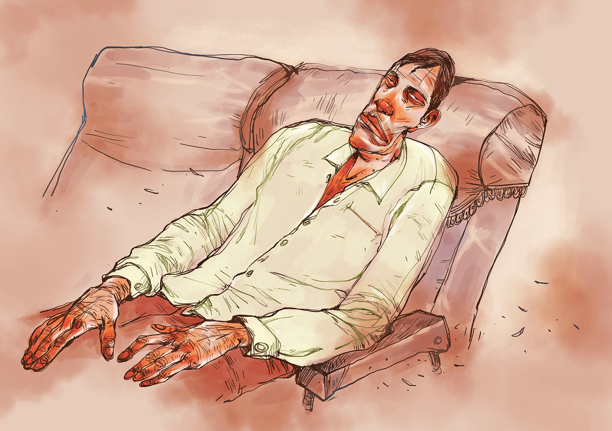

 

<h2 align=center>ঘুম</h4><h3 align=center>লেখা:</h3>

আজব তো, আমি কি মরে গেছি নাকি! দাফন-কাফনের কথা আসছে কেন? মাইলের পর মাইল নাড়ার আগুনে পুড়ছে নড়াইল টু যশোরের ল্যান্ডস্কেপ। সাদা আলখেল্লা পরা দীর্ঘ চুলের এস এম সুলতান বেজার মুখে ট্রাক্টরে সওয়ার হয়েছেন। গাড়ি নষ্ট হলো। ঢাকাগামী লাস্ট বিমান ধরতে এখন ওই নছিমনই ভরসা! কিন্তু বিমানবন্দর কত দূরে, রাশেদ তা ঠিক ঠাওর করতে পারে না। তখন সেলফোন যুগ ছিল না যে গুগল করবে। ঘর্ঘর শব্দে তার ঘুম ভাঙে। ভোরের হাওয়ায় ঠান্ডা লাগে, কেমন যেন শীতল একটা অনুভূতি হয়। ভালো লাগে রাশেদ ফারাজীর। সমস্ত বাসযাত্রী বেঘোরে ঘুমাচ্ছে। ড্রাইভার, সে-ও ঢলে পড়েছে তন্দ্রায়! মুহূর্তে ব্রিজ ভেঙে শূন্যে উঠে গেছে বাস। সুবহে সাদিকের নীল আকাশে উড়ছি বাসসুদ্ধ আমরা সবাই। চরাচরে নিঃসীম শূন্যতা। এর মধ্যে হঠাৎ কাচ ভাঙার শব্দ। তারপর ফুটে ওঠে আহত আদিম এক যৌথ চিৎকার। কোনো স্বপ্নদৃশ্য নয়, বাস্তব।

রাশেদ ফারাজীর জীবনে এমনটাই ঘটেছে বহুকাল আগে। ঘটেছে কি? কপালগুণে তার প্রেম হয়েছে। বধূর পাশে শুয়ে বাচ্চার বেড়ে ওঠা দেখা হয়েছে...দেখা হয়েছে আরও আরও কিছু। কিন্তু কী মুশকিল, এ ঘুম থেকে বের হতে না পারলে এরা তো আমাকে কবরেই শুইয়ে দেবে! চিরকালই আমি অলস, ঘুমকাতুরে। বাঁচতে হলে আলসেমি ছাড়তে হবে। এই যে ভাই, শুনছেন...আওয়াজ কারও কানেই যায় না। শালার মরার ঘুম কেন ভাঙছে না আমার! খুব করে চাইছি, বাবা এসে কানটা ধরে বিছানায় বসিয়ে দেন। মাথায় হাত রেখে মা ডাক দেন, ‘ওঠ ফারাজী, অনেক বেলা হইছে বাবা।’ ইশকুলের ঘণ্টার শব্দের সাথে পাল্লা দিয়ে দৌড়াই। ঘণ্টার অনুরণন থামার আগেই পৌঁছাতে চাই! শেষমেশ এই ঘুমই কাল হলো। ওভারডোজ না, ক্রসফায়ার না, লিভারসিরোসিস না, গুম না, খুনও নয়; স্রেফ ঘুম। আর এখন নিয়তির মতো বেজেই চলেছে একটা অ্যাক্সিডেন্টের দৃশ্য। উল্টানো ট্রাকের চাকা ঘুরছে। অ্যালুমিনিয়ামের বিশাল কনটেইনারগুলো গড়িয়ে গড়িয়ে যাচ্ছে হাইওয়ের বাঁকে। কালো পিচের রাস্তায় দুধের নহর। সাদা মসলিনে মিশে যাচ্ছে ভ্যানচালকের থেতলে যাওয়া হাড়–মাংস–ঘিলু...।

নিকুচি করি, দৃশ্যের নিকুচি করি। কেউ আমাকে জোরছে লাথি কষে ঘুমটা ভাঙিয়ে দাও। নাহ্‌, কিছুতেই কিছু হচ্ছে না! হচ্ছেই না। ঘুমের ঘোরেই সেলফোন হাতড়াই। ফেসবুকে ঢুকে দেখি, সব ঠিকঠাক। যাক বাবা, এই যাত্রায় বাঁচা গেছে! কিন্তু এসব কী? ফেসবুকের বন্ধুরা আমার সাথে ছবি আপলোড দিচ্ছে ক্যান? বুকটা ধক করে ওঠে। অ্যাঁ, তাহলে আমি আর নাই! কেবল ছবি?

