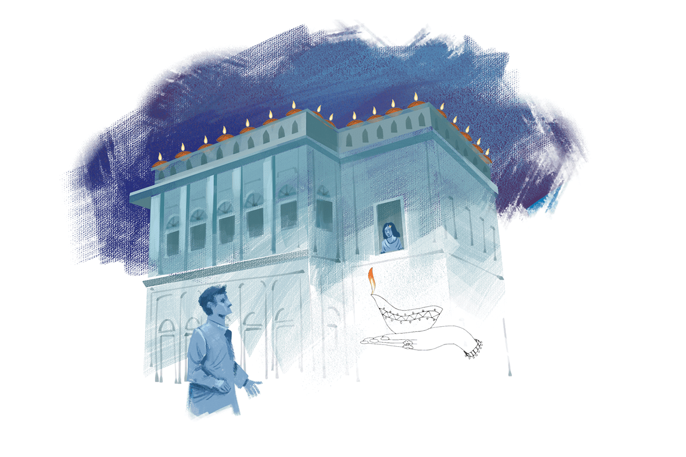

 

<h2 align=center>দেওয়ালির প্রদীপ</h4><h3 align=center>সাদত হাসান মান্টো</h3>

ছাদের পাঁচিলের ওপর দেওয়ালির প্রদীপগুলো দৌড়ে এসে হাঁপাতে থাকা বাচ্চার মতো ধুকপুক করছিল।

মুন্নিও দৌড়ে এল। নিজের ছোট্ট হাত দিয়ে মাটিছোঁয়া ঘাগরা ওপরে ওঠাল। তারপর দাঁড়াল ছাদের নিচে গলিতে জলের পাইপের নিচে এসে। কাঁদতে থাকা ওর চোখে ছাদের জ্বলতে থাকা প্রদীপগুলো কতগুলো উজ্জ্বল হিরের টুকরা জুড়ে দিল। সে নিজেও প্রদীপের শিখার মতো কেঁপে উঠল। হেসে নিজের হাতের মুঠি খুলল সে। হাতে ঘামে ভেজা কয়েকটা পয়সা। তারপর প্রদীপ কিনবে বলে ছুটে বাজারের দিকে গেল।

ছাদের পাঁচিলের ওপর সন্ধ্যার ঠান্ডা হাওয়ায় তখন দেওয়ালির প্রদীপ ফরফর করে জ্বলছে।

সুরেন্দ্র ধুকপুক করা হৃদয় বুকের ভেতর লুকিয়ে চোরের মতো গলির ভেতর এসে ঢুকল। অস্থিরভাবে পায়চারি করতে লাগল ছাদের সেই পাঁচিলের নিচে। ঘাড় ঘুরিয়ে দেখল সারবাঁধা প্রদীপগুলোর দিকে। প্রদীপের শিখা হাওয়ায় দপদপ করছিল। মনে হচ্ছিল যেন তার শিরায় নাচতে নাচতে ছুটে চলছে রক্তের স্রোত! হঠাৎ সামনের জানালাটা খুলে গেল। সুরেন্দ্র আপাদমস্তক এক জোড়া চোখ হয়ে গেল। জানালার শিক ধরে একটা মেয়েকে দেখল নিচে গলির দিকে। নিমেষে ওর চেহারা জ্বলজ্বল করে উঠল।

কিছু ইশারা দেওয়া-নেওয়া হলো। চুড়ির ঝনঝন শব্দের সঙ্গে বন্ধ হলো জানালা। সুরেন্দ্র যেন নেশাগ্রস্তের মতো টলতে টলতে চলে গেল।

ছাদের পাঁচিলের ওপর দেওয়ালির প্রদীপ কনের শাড়ির ওপর বোনা নক্ষত্রের মতো ঝলমল করতে লাগল।

কুম্ভকার সরজু এসে হাজির হলো লাঠি ঠুকঠুক করতে করতে। দম নেওয়ার জন্য থামল একটু। রাস্তা খোঁড়ার ইঞ্জিনের মতো ওর বুকের ভেতর জমে থাকা কফ ঘোরাফেরা করছিল। সে হাঁপানির রোগী। গলার রগগুলো বেলুনের মতো কখনো ফুলে উঠছিল, কখনো–বা নেতিয়ে পড়ছিল। ঘাড় উঠিয়ে ঘোলাটে দৃষ্টিতে ঝলমল ঝলমল করতে থাকা প্রদীপগুলোর দিকে তাকাল সে। তার মনে দূরে কোথাও, অনেক...অনেক দূরে…অনেকগুলো শিশু সারবেঁধে খেলছে। সরজুর হাতের লাঠি যেন ভারী হয়ে এল। কফ ফেলে সে আবার পিঁপড়ার মতো চলতে লাগল।

ছাদের পাঁচিলে ঝলমল করতে থাকল প্রদীপ।

আবার এক শ্রমিক এল। তার ছেঁড়া জামার আড়াল থেকে বুকের লোম পুরোনো নষ্ট পাখির বাসার খড়কুটোর মতো লাগছিল। মাথা উঁচিয়ে সে তাকাল প্রদীপের সারির দিকে। তার মনে হলো, আকাশের ধূসর কপালে বড় বড় ঘামের বিন্দু চকচক করছে যেন। আবার তার ঘরের অন্ধকারের কথা মনে পড়ল। কাঁপতে থাকা আগুনের শিখাগুলোর দিকে আড়চোখে তাকাতে তাকাতে সে এগিয়ে গেল সামনে।

ছাদের পাঁচিলে দেওয়ালির প্রদীপ চোখের পাতা ফেলতে লাগল।

নতুন আর চকচকে বুটের মচমচ শব্দ তুলে একজন এল। দেয়ালের কাছে সিগারেট ধরানোর জন্য থামল। তার চেহারা সোনার মোহরের ওপর বাদশার মুখের মতো ভাবলেশহীন। জামার কলারে ঢাকা ঘাড় উঠিয়ে প্রদীপগুলোর দিকে তাকানোর পর তার মনে হলো, যেন অনেকগুলো স্বর্ণকারের দোকানে স্বর্ণ গলে গলে পড়ছে। মচমচ করা তার চকচকে জুতায় নাচতে থাকা আগুনের ছবি পড়ছিল। সেই ছবি নিয়ে খেলতে খেলতে সে সামনে এগিয়ে গেল।

যা কিছু ওরা দেখল, যা কিছু ওরা শুনল, কাউকে কিছুই বলল না। হঠাৎ দমকা বাতাস এল। আর এক এক করে সব প্রদীপ নিভে গেল।

উর্দু সাহিত্যের অন্যতম গল্পকার সাদত হাসান মান্টো (১৯১২—১৯৫৫)। জন্মেছিলেন অবিভক্ত ভারতের পাঞ্জাবের সামরালে। মৃত্যু পাকিস্তানের লাহোরে। তাঁর সাহিত্যজীবন শুরু হয় রুশ উপন্যাস অনুবাদের মধ্য দিয়ে। সে সময় রুশ প্রতিকবাদী সাহিত্যের প্রতি অনুরক্ত হন। সেই আদলে বেশ কিছু গল্প লিখেছিলেন তিনি। আবার দেশভাগ ও দাঙ্গা নিয়ে বেশ কিছু গল্প লিখতে গিয়েও এই ধরন তিনি ব্যবহার করেছেন। ১১ মে সাদত হাসান মান্টোর জন্মদিন। এ উপলক্ষে পত্রস্থ হলো তাঁর এই গল্পের অনুবাদ। উর্দুতে গল্পটির নাম ‘দিওয়ালি কি দিয়ে’। আর এ গল্প নেওয়া হয়েছে ‘মান্টোকে আফসানে’ (মান্টোর গল্প) সংকলন থেকে।

উর্দু থেকে অনুবাদ: জাভেদ হুসেন

