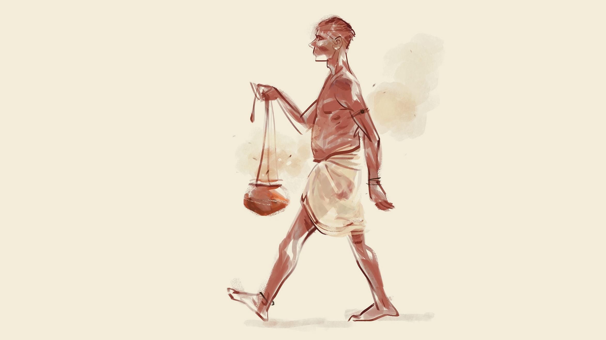

 

<h2 align=center>সদগতি</h4><h3 align=center>লেখা: </h3>

দেহভস্মের ঘটিটা হাতে নিয়ে পকেট থেকে পাঁচ শ টাকা বের করে দিলাম তাকে।‘এই শ্মশানে মড়া পুড়াইলে এর চায়া বেশি দেয়, আপনারটা তো ইসপিশাল কেস,’ টাকাটা না নিয়ে বলল সে। ‘নিজে কামাইবেন লাখ ট্যাকা আর আমারে দিবেন পাঁচ শ!’হতভম্ব হলাম। চণ্ডালের বাঁকা হাসি নীরব কিন্তু সাংঘাতিক। কথা না বাড়িয়ে ঘটিটা ফেলে হাজার টাকার নোট বাড়িয়ে দিলাম।

‘দশের নিচে কাম অইবো না! এই কাম আপনেই পথ্থম করেন নাই! এইগুলান বহু বচ্ছর ধইরা চলতাছে।’

যাত্রাপালার দুজন বেকার অভিনেতা খুঁজতেই বেশি মনোযোগী ছিলাম। অন্য কিছু মাথায় ছিল না। কয়েক মুহূর্ত ভেবে তড়িঘড়ি দশ হাজার টাকা দিয়ে দিলাম তাকে। ভেবেছিলাম, খুন হওয়া লাশের বন্দোবস্ত করার সহজ আর অভিনব উপায় বের করেছি। ইদানীং খুনের চেয়ে লাশের ব্যবস্থা করা আরও কঠিন হয়ে গেছে। দীর্ঘশ্বাস ফেললাম, ‘আমি শুধু লাশের ব্যবস্থা করি...আর কিছু না।’

‘তাইলে মারার কামটাও হাতে নেন...আপনেরও লাভ আমারও লাভ।’চুপ মেরে রইলাম। মাথায় একটা চিন্তাই ঘুরপাক খাচ্ছে।‘আমারে পার্টনার বানায়া লন, ব্যবসা জমব।’

মাথা নেড়ে সায় দিলাম। চণ্ডালকে আসলে মিথ্যে বলেছি। আমি কেবল সদগতিই করি না, খুনও করি!

