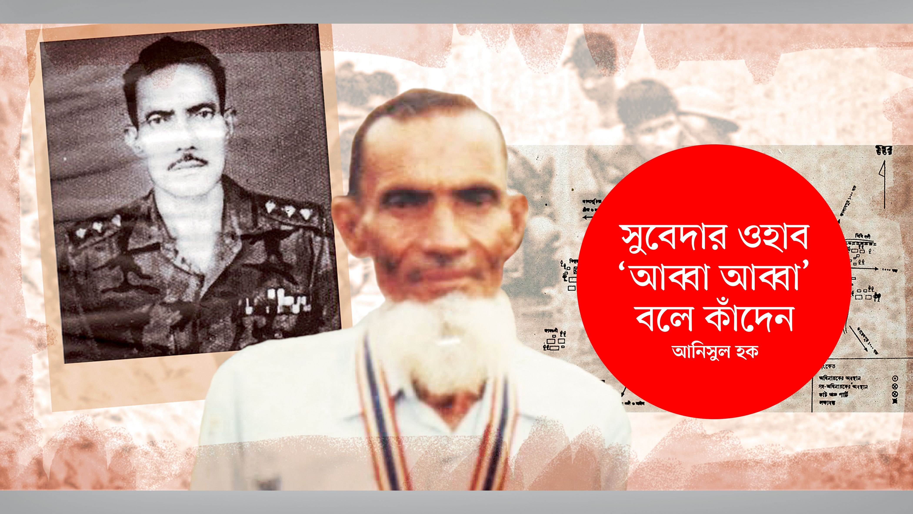

 

<h2 align=center>সুবেদার ওহাব ‘আব্বা আব্বা’ বলে কাঁদেন</h4><h3 align=center>আনিসুল হক</h3>

সুবেদার আবদুল ওহাব বীর বিক্রমের গল্প বলতে গেলেই এ কথাটা আমার খুব মনে পড়ে—ওহাব কাঁদছেন। অঝোরে কাঁদছেন। তাঁর হো চি মিন মার্কা তোবড়ানো গাল বেয়ে জলের ধারা নেমে চিবুকে এসে শ্মশ্রুরাজি সিক্ত করছে।

‘আব্বা, আব্বা’ বলে ওহাব কাঁদেন।

১৯২৭ সালে জন্ম নেওয়া আবদুল ওহাব যখন কাঁদছিলেন—আজ থেকে ২৫ বছর আগে—১৯৯৬ সালে, তখন বাংলাদেশে উদ্​যাপিত হচ্ছিল স্বাধীনতার রজতজয়ন্তী। আর আজ স্বাধীনতার সুবর্ণজয়ন্তীর প্রাক্কালে সেই আবদুল ওহাবের সিক্ত চোখ আমাদের মনে পড়ছে। তাঁর অবিশ্বাস্য বীরত্বগাথার কারণেই তাঁকে আবার মনে পড়ছে। এবং আরও মনে পড়ছে, ১৯৯৬–এ বাবার কথা স্মরণ করে যখন তিনি কাঁদছিলেন, সে সময় তাঁর বয়স ছিল ৬৯।

ছোটখাটো শরীর। চিবুকে একগোছা সাদা দাড়ি। বয়সের বলিরেখা মুখমণ্ডলে, চোখ কোটরাগত। দেখে মনে হয়, বিশাল বাংলাদেশের এক খুব সাধারণ বৃদ্ধ।

কিন্তু না, মানুষটি সাধারণ নন। অসাধারণ। অলৌকিক মানুষ। অবিশ্বাস্য তাঁর কীর্তি।

মুক্তিযোদ্ধাদের মধ্যে তিনি এক অনন্য লড়াকু যোদ্ধা। ১৯৭১ সালে হয়ে উঠেছিলেন যেন রক্তের স্বাদ পাওয়া বাঘ। একের পর এক অ্যাম্বুশ চালিয়ে হত্যা করেছিলেন শত্রুদের। যে যুদ্ধে জয়লাভ করা কোনো মানুষের পক্ষে সম্ভব নয় বলে সমরবিশেষজ্ঞদের ধারণা, নিজ উদ্যোগে সেই যুদ্ধে গেছেন তিনি। ফিরে এসেছেন বিজয়ীর বেশে, নিজের দলের তেমন ক্ষয়ক্ষতি ছাড়াই।

১৯৭১ সালে সুবেদার মো. আবদুল ওহাব ছিলেন কুমিল্লা ক্যান্টনমেন্টে। যুদ্ধ করেছেন চতুর্থ ইস্ট বেঙ্গল রেজিমেন্টে। ৭ নম্বর প্লাটুনের কমান্ডার ছিলেন। পরবর্তীকালে অবশ্য সি কোম্পানির অধিনায়কত্বও দেওয়া হয় তাঁকে। কুমিল্লা-ব্রাহ্মণবাড়িয়া এলাকার সালদা নদী, মন্দভাগ, কসবা, ব্রাহ্মণবাড়িয়া এলাকা ছিল তাঁর যুদ্ধক্ষেত্র। ওই সব এলাকার মানুষ বলত, ওহাব সাহেবের সঙ্গে জিন আছে। পাকিস্তানি মিলিটারি দু–দুবার ৫০ হাজার টাকা পুরস্কার ঘোষণা করে তাঁকে জীবিত বা মৃত ধরে দেওয়ার জন্য। নিজের নাম বদলে তিনি রাখেন ‘ল্যাংড়া’। ওয়্যারলেসে গোলা চেয়ে মেসেজ পাঠাতেন, ‘ল্যাংড়া বলতেছি, কলার থোড় পাঠাইয়া দাও।’ দেখতে সাধারণ কৃষকের মতো, আর তাঁর পরনে থাকত লুঙ্গি-গেঞ্জি। কে তাঁকে চিনতে পারবে? লাঙল নিয়ে চাষার বেশে, ছিপ হাতে মাঝির বেশে থাকতেন তিনি মাঠেঘাটে। প্রায় প্রতিদিনই তাঁর গোবেচারা ছদ্মবেশের আড়াল থেকে বেরিয়ে আসত স্বয়ংক্রিয় আগ্নেয়াস্ত্র, মারা পড়ত শত্রুরা।

১৯৯৬ সালের ডিসেম্বরে আমরা একজন প্রকৃত যোদ্ধার খোঁজ করছিলাম। কর্নেল (অব.) শাফায়াত জামিলের যুদ্ধস্মৃতি চাওয়া হলে তিনিই বলেছিলেন ওহাবের কথা। বললেন, ‘প্রকৃত যোদ্ধার কাছে যান, ওহাবের কাছে যান।’

পরে খুঁজে পাওয়া গিয়েছিল তাঁকে।

১৯৯৬–এর ২ ও ৩ ডিসেম্বর এই বীরের সঙ্গে আমরা যাত্রা করেছিলাম কুমিল্লা-ব্রাহ্মণবাড়িয়ার প্রত্যন্ত দুর্গম এলাকায়। ২৫ বছর পর দুর্ধর্ষ কমান্ডার আবার এসে তাঁর রণক্ষেত্রগুলোয় দাঁড়ালেন। ‘ওহাব’ নামের জাদুতে সঙ্গে সঙ্গে তাঁকে ঘিরে ধরল গ্রামবাসী।

এদিক-সেদিক থেকে এল সহযোদ্ধারা। তিনি হাত তুলে দেখাতে লাগলেন তাঁর পজিশন নেওয়ার জায়গা, সেসব যুদ্ধপবিত্র মাটি; গাছের আড়াল, নদীতীর। ততক্ষণে বীরত্বের স্মৃতিগৌরব এসে পড়ছে তাঁর মুখমণ্ডলে। চোখের কোণে চিক চিক করছে জল। সেই অশ্রুকণা মনে রেখে মুক্তিযুদ্ধের এই অনন্যসাধারণ কমান্ডারের সঙ্গে আমরাও ফিরে যাচ্ছি তাঁর যুদ্ধক্ষেত্রগুলোতে, গৌরবের একাত্তরে।

ঝিকুরা অভিযান: নদীতীরে অ্যাম্বুশ

ব্রাহ্মণবাড়িয়ার কসবা থানার মইনপুর বাজার। লোকজন ঘিরে ধরেছে আবদুল ওহাবকে। ‘চিনতে পারছ তোমরা? আমি ক্যাপ্টেন (অনারারি) ওহাব।’ সঙ্গে সঙ্গে সালাম উচ্চারিত হলো এর–ওর মুখে। চেহারায় তাঁকে অনেকেই চেনে না, নামে চেনে, কেউ বা চেনে ‘ল্যাংড়া’ বলে। আর চেনে এক উদ্ধারকর্তা হিসেবে, পাকিস্তান সেনাবাহিনীর কুখ্যাত ক্যাপ্টেন বুখারির হাত থেকে যিনি বাঁচিয়েছিলেন তাদের।

‘আমরা এখন কোথায় যাচ্ছি?’ জিজ্ঞাসা করলাম ওহাব সাহেবকে।

‘ঝিকুরা অভিযানে। ক্যাপ্টেন বুখারিকে মারতে।’ বুদ্ধিদীপ্ত জবাব তাঁর।

কুমিল্লা অঞ্চলের মানুষের কাছে এক ভয়ংকর কিংবদন্তি পাকিস্তানি ক্যাপ্টেন বুখারি। এই নৃশংস অফিসার নাকি এক হাতে জিপের স্টিয়ারিং ধরে অন্য হাতে গুলি করে বাঙালি মারত, অবলীলায়।

‘চরিত্র খারাপ ছিল তার, মেয়েদের পেছনে লেগেছিল,’ বলেন ওহাব।

ঝিকুরা গ্রামের পাশ ঘেঁষে বইছে সালদা নদী। ওহাব বললেন, এখন নদী একটু মরা। ২৫ বছর আগে এই জায়গায় একটা বটগাছ ছিল। সেই বটগাছের নিচে এলএমজি নিয়ে পজিশন নিয়েছিলাম আমি। তখন বর্ষাকাল। এসব জায়গা ছিল বিলের মতো। পানিতে আধোডোবা ধানখেত, পাটখেত।

একাত্তরের ১০ জুন। আগের দিন ভারতের কোনাবন ক্যাম্পে কোম্পানি অধিনায়ক গাফফার সাহেবের কাছে ঝিকুরা অভিযানের জন্য অনুমতি নিয়েছেন ওহাব। বলেছেন, ‘পাকিস্তানি সেনারা কসবা থানার সালদা নদী, মন্দভাগ বাজার, কামালপুর এলাকায় প্রতিরক্ষাব্যূহ গড়ে তুলেছে। এসব এলাকায় পাকিস্তানি বাহিনী রসদ পাঠায়, আসা-যাওয়া করে নদীপথে। কুমিল্লা থেকে সিঅ্যান্ডবি সড়ক দিয়ে আসে কালামুড়িয়া ব্রিজ পর্যন্ত। তারপর গাড়ি ছেড়ে দিয়ে ওঠে নৌকায়। সালদা নদী দিয়ে শত্রুর এই চলাচল বন্ধ করে দিতে চাই। চাই নদীতে অ্যাম্বুশ করতে।’ অনুমতি মিলেছে। এবার অপারেশন।

তাঁর প্লাটুন নিয়ে খুব ভোরে কোনাবন ক্যাম্প ছাড়লেন কমান্ডার ওহাব। ২২ জনের দল। সহ–অধিনায়ক নায়েক সুবেদার মঙ্গল মিয়া। ভারী অস্ত্রের মধ্যে একটি মেশিনগান ও সাত–আটটি এলএমজি। নৌকায় যাত্রা।

ঝিলমিল ধানখেত পেরিয়ে কলতাদিঘির পাড় ও নেপতারহাট হয়ে পৌঁছালেন মইনপুর গ্রামে। দূরে দেখা যাচ্ছে সালদা নদী। এই নদীই পাকিস্তানি বাহিনীর যোগাযোগের পথ। ওহাব দেখলেন, নদী দিয়ে যাচ্ছে পাকিস্তানি বাহিনী। তাদের সামনে স্পিডবোট, পেছনে কয়েকটা নৌকা। স্পিডবোটটা খানিকক্ষণ পরপর থামছে, যাতে পেছনের নৌবহর আবার আসে তার কাছে। নৌকায় সৈন্য, নৌকার দুই পাশে নদীতীর ঘেঁষেও সৈন্য। ওহাবের আফসোস হলো। আরেকটু আগে এসে পৌঁছালেই তো ওদের আক্রমণ করা যেত। যাক, অসুবিধা নেই।

আগে থেকেই তিনি জানেন, দিনে দিনেই একই পথে ফিরে আসে ওরা।

এ এলাকার বিভিন্ন স্থানে পাকিস্তানি বাহিনীর অবস্থান। সুতরাং যেকোনো অভিযান পরিচালনার আগে নিজেদের প্রতিরক্ষা ও প্রত্যাবর্তনের ব্যাপারটি নিশ্চিত করা দরকার। তাই মইনপুরের উত্তরে কামালপুর গ্রামের পূর্ব দিকে বিনি নদীর পশ্চিম পাড়ে ব্রিজের কাছে রাখলেন হাবিলদার মুসলিমকে, মেশিনগানসমেত। মইনপুরের দক্ষিণ-পূর্বে কায়েমপুর গ্রামে একটি এলএমজি বসানো হলো, মন্দভাগ বাজারের দিতে তাক করে। আর মইনপুরেরই উত্তর-পশ্চিমে রইল আরেকটি এলএমজি, গোবিন্দপুরের দিকে মুখ করে।

পরের কাজ হলো অ্যাম্বুশের জন্য উপযুক্ত জায়গা বাছাই। দলকে মইনপুরে রেখে নিজে গেলেন ওহাব, নদীর ধারে, ঝিকুরা গ্রামের পাশে। বটগাছের কাছের জায়গাটা পছন্দ হলো তাঁর।

দুপুর ১২টার দিকে দল নিয়ে নদীর ২৫ গজের মধ্যে পজিশন নিলেন। এলএমজিসহ নিজে রইলেন বটগাছের পাশে। সঙ্গে রইল পাঁচ–ছয়জন। আর নায়েক সুবেদার মঙ্গল মিয়া তিন–চারটি এলএমজিসহ নদীর পশ্চিম পাড়ে পজিশন নিল কয়েকজন সঙ্গী নিয়ে। বটগাছের ঠিক উত্তর দিকে ২৫–৩০ গজের মধ্যেই রইল আরও একটি সশস্ত্র দল। বটগাছের দক্ষিণে আগাম সংকেত দেওয়া ও দরকার হলে গুলি করার জন্য মোতায়েন করা হলো সিপাহি শামসু ও অন্য একজনকে।

পুরো দলটি মিলেমিশে আছে পানি, ধানখেত, শণগাছের আড়ালে। রুদ্ধশ্বাস প্রতীক্ষা শত্রুর জন্য। ১২টা থেকে ২টা—পেরিয়ে গেল দুই ঘণ্টা। এর মধ্যে দেখা গেল, একটা স্পিডবোট আসছে দ্রুতগতিতে। একেকটি মুহূর্ত যাচ্ছে, আর শত্রুর স্পিডবোট নিকটতর হচ্ছে। সেটি ঢুকে পড়ল ফাঁদ-দলের আওতার মধ্যে। ওহাব তাঁর এলএমজির নল তাক করলেন স্পিডবোটের দিকে। শুরু হলো গুলি। তাঁর গুলির সঙ্গে ২০টি নিপুণ হাত একযোগে ফায়ার শুরু করল। সুবেদার ওহাব প্রথমে অনুভূমিকভাবে, পরে রিফু করার মতো খাড়া করে বুনলেন বুলেটের সেলাই।

স্পিডবোটে কতগুলো ছাতার আড়ালে ছিল পাকিস্তানি অফিসাররা। মুহূর্তের মধ্যে সব কটি ছাতা উল্টে ছিটকে পড়ল পানিতে। শতচ্ছিদ্র–অচল হয়ে গেল বোটটি। শত্রুসেনাদের দেহ লুটিয়ে পড়ে রইল বোটে। একজন শত্রু পড়ল পানিতে। হাত–পা দিয়ে পানি ঠেলে সে চেষ্টা করল নিজের দেহ খাড়া করতে। ফলে ওহাবকে খরচ করতে হলো আরও দুটো বুলেট। তারপর সব নীরব।

সবাই দৌড়ে গেল স্পিডবোটের কাছে। উপুড় হয়ে পড়ে আছে এক অফিসার। শরীর উল্টিয়ে মুখ দেখে তাকে চিনলেন ওহাব। ক্যাপ্টেন বুখারি। তার দেহে বিদ্ধ হয়েছে ৭০–৭২টি বুলেট।

১২ জন পাকিস্তানি অফিসার মারা পড়ল এ অভিযানে। এদের মধ্যে ২ মেজর, ৪ ক্যাপ্টেন ও ১ সুবেদার মেজর। ছিল এক বাঙালি মেডিকেল অফিসার ও দুজন লে. কর্নেল। তাঁদের হাতের অস্ত্র হাতেই ধরা ছিল। গুলি করার সময় পাননি তাঁরা।

স্পিডবোটের পেছনে নৌকাসমেত যে শ খানেক পাকিস্তানি সৈন্য ধীরে ধীরে আসছিল, গোলাগুলির শব্দ পেয়ে তারা আর আসেনি। মইনপুরের একজন দরবেশ ফকিরের কাছে জানা গেল, ক্রলিং করে কসবা চলে গেছে ওরা।

একটা খুব দরকারি ম্যাপ পাওয়া গেল। এতে এই এলাকার পাকিস্তানি বাহিনীর গোলন্দাজ অবস্থান চিহ্নিত ছিল। পাওয়া গেল অস্ত্রশস্ত্র, ওয়্যারলেস। ডুবন্ত স্পিডবোটের ইঞ্জিন খুলে এনে রাখা হলো পাটখেতে।

সফল অভিযান শেষে ফিরছে ওহাবের দল। এমন সময় ৯ প্লাটুনের কমান্ডার নায়েব সুবেদার শহীদ ছুটে এলেন। ক্যাপ্টেন বুখারি মারা গেছে শুনে তিনি খুব খুশি। পাকিস্তানিদের হাত থেকে পাওয়া মেশিনগানটি তুলে নিলেন। ২৫০টি গুলির শিকল গলায় জড়ালেন সাপের মতো। ছুটে গেলেন আগে আগে, কোম্পানি কমান্ডার গাফফার সাহেবের কাছে। তাঁর কাছে খবর পেল গ্রামবাসী আর ক্যাম্পের লোকজন। ওই আসছে ওহাব, স্পিডবোট আর অনেক অফিসার আর ক্যাপ্টেন বুখারিকে মেরে।

চারদিকে তখন হর্ষধ্বনি। জয় বাংলা ধ্বনির ভেতর দিয়ে সারা দিন পানি ডিঙানো উপোস কাটানো রণক্লান্ত ওহাবের দল ক্যাম্পে ফিরে এল।

ঝিকুরার পাশ ঘেঁষে সেই নদী এখনো বয়ে চলেছে। ছোট খাড়া খরস্রোতা নদীর ওপরে এখন বাঁশের সাঁকো। কালের সাক্ষী বটগাছটা নেই। নদীটাও খানিক সরে এসেছে।

স্থানীয় লোকজন ঘিরে আছে ক্যাপ্টেন ওহাবকে। কী ভাবছেন তিনি? ২৫ বছর আগের সেই সময়টা যদি ফিরে পাওয়া যেত!

না, সময় ও নদীস্রোত ওহাবের জন্য অপেক্ষা করেনি।

বিপ্লব বেঁচে আছে, জেগে আছে বাংলাদেশ

একাত্তরে সুবেদার ওহাবের বয়স ছিল ৪৫। তখন মার্চ মাস। ওহাবের স্ত্রী সন্তানসম্ভবা। সন্তান জন্মানোর দিন ঘনিয়ে আসছে। ইতিমধ্যেই এ দম্পতি তিনটে সন্তান লাভ করেছেন। তিনটেই মেয়ে। ওহাব সুফি ধরনের মানুষ। পড়াশোনা ক্লাস এইট পর্যন্ত। তাঁর বাবা আলী নেওয়াজ ছিলেন প্রাথমিক স্কুলের শিক্ষক। ওহাবের বাবার দুটো আশা পূরণ হয়নি। ওহাবকে ডেকে তিনি বলেছেন, ‘দুইটা জিনিস দেইখা যাইতে পারলে মনে আর কোনো আফসোস থাকত না, আমার যদি একটা নাতি হইত, আর যদি এই খড়ের ঘরে টিনের চালা হইত।’

মুক্তিযুদ্ধের পর ওহাবের বাড়িতে টিনের একটা ঘর হয়েছে। আছে মুক্তিযুদ্ধের সময় জন্ম নেওয়া তাঁর একটি ছেলে—বিপ্লব। অনুসন্ধানে জানা গেল, ২০২১ সালে, এখন কুমিল্লা ক্যান্টনমেন্ট এলাকায় তৈজসপত্রের ব্যবসা করেন সেই বিপ্লব।

১৯৯৬–এ যখন সুবেদার ওহাবের সঙ্গে কথা বলি, তখন তাঁর ছিল একটিমাত্র টিনের ঘর। বারবার অনুরোধ সত্ত্বেও সেই বাড়িতে আমাদের নেননি ওহাব। একজন অসামান্য যোদ্ধা তাঁর সামান্য গৃহখানিতে আমাদের নিতে চাননি। হয়তো দেখাতে চাননি তাঁর জীবনের ব্যক্তিগত ব্যর্থতাগুলো।

আজ থেকে ২৫ বছর আগে ওহাব আমাদের শুনিয়েছিলেন তাঁর বীরত্ব ও সাহসের গল্প। ১৯৯৬–এর ডিসেম্বরে সেগুলো ছাপা হয়েছিল ভোরের কাগজ–এ। তবে যুদ্ধদিনের রণাঙ্গনের রুদ্ধশ্বাস বৃত্তান্ত বলার ফাঁকে বাবা আলী নেওয়াজের কথা বলতে গিয়ে হাউমাউ করে কাঁদছিলেন আবদুল ওহাব। কারণ, টিনের চালাটা দেখে যেতে পারেননি তাঁর বাবা!

ওহাবের চোখের পানিতে প্রতিফলিত বিদ্যুতের আলোর দিকে তাকিয়ে বিভ্রান্ত হই আমরা। ভাবি, এই কি সেই অকুতোভয় মুক্তিযোদ্ধা, যাঁর নামে পাকিস্তানি সৈন্যরা ভয়ে কাঁপত থরথর করে, যাঁর মাথার জন্য তারা পুরস্কার ঘোষণা করেছিল?

সুবেদার আবদুল ওহাব (পরবর্তীকালে অনারারি ক্যাপ্টেন) বীর বিক্রম মারা যান ২০০৭ সালে।

২০২১ সালে স্বাধীনতার সুবর্ণজয়ন্তীর ১৩ বছর আগে মারা গেছেন আবদুল ওহাব। তাঁর বাবা মারা গেছেন তারও বহু বছর আগে। কিন্তু আজও আমাদের চোখে ভাসে ওহাবের সেই হাহাকারভরা কান্না, ‘আব্বা, আব্বা...আমার আব্বা আমার টিনের ঘর দেখে যেতে পারলেন না!’

